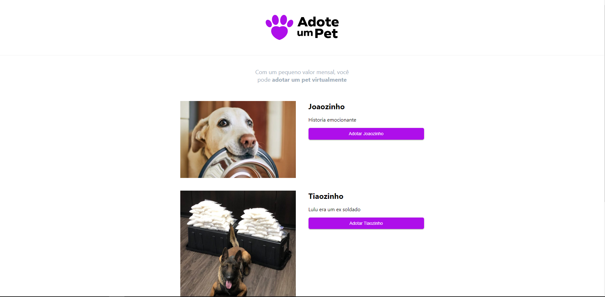
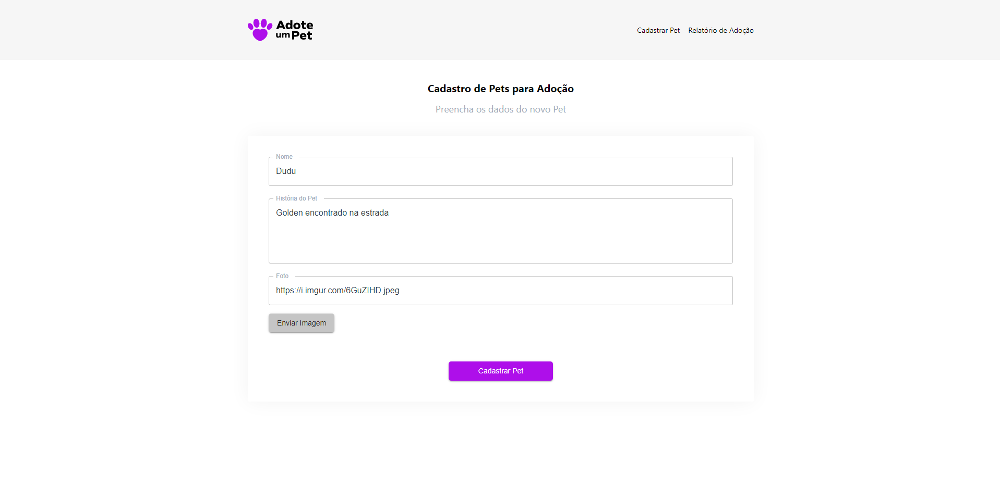
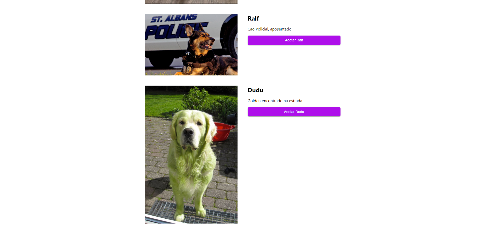
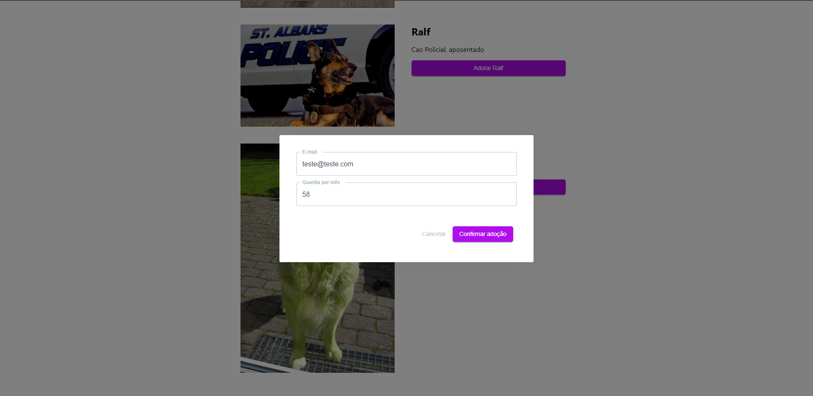
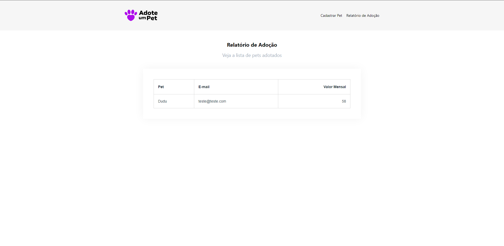

# PETS

# Sobre o projeto

Aplicação web para adotar um PET(financeiramente), usuários comuns pode escolher um pet em uma lista e adota-lo colocando email e valor.
Um usuário administrador pode verificar o email e o valor de quem adotou o pet, tambem consegue inserir novos pets

### Explicação do sistema

- Na página principal é listado os pets que podem ser adotados

- Na página de administração pode inserir um novo pet preenchendo o formulario

- Na página de contabilidade pode ver quem adotou os pets e qual valor doou

### Tela inicial


### Tela cadastro pet


### Tela inicial atualizada


### Tela de adoção


### Tela de contabilidade


# 🚀 Começando

Essas instruções permitirão que você obtenha uma cópia do projeto em operação na sua máquina local para fins de desenvolvimento e teste.

## 📋 Pré-requisitos

- npm / yarn
- jdk ver: 17
- springtoolsuite4

## 🔧 Instalação
### :warning::warning: **A pasta imgs**: é para guardar as imagens usadas no readme.md! Apagar ela depois do clone :warning::warning:

``` bash
## clonar repositório
git clone https://github.com/PauloCSantos/pets-app.git

# no diretório pets

## entrar na pasta do projeto no terminal
cd frontend

## instalar as dependencias
npm i

## executar o projeto
npm run dev

# no diretório petsapi
abrir o diretório no springtoolsuite4

## executar o backend
aperte para executar o spring

## Ver banco de dados H2
no navegador coloque localhost:8080/h2-console
ou na porta que aparecer no console do springtoolsuite4
```

## 🛠️ Construído com

- NextJs
- MaterialUI
- TypeScript
- Axios
- Java
- SpringBoot
- H2db

## ✒️ Autor

* **Paulo C Santos** - [Linkedin](https://www.linkedin.com/in/paulocsantos1995/)

## 🖐️ Agradecimento

Agradeço ao TreinaWeb pelo workshop MultiStack. Foram vários dias de aprendizado e muita mão na massa

- Link da TreinaWeb: https://www.treinaweb.com.br/
